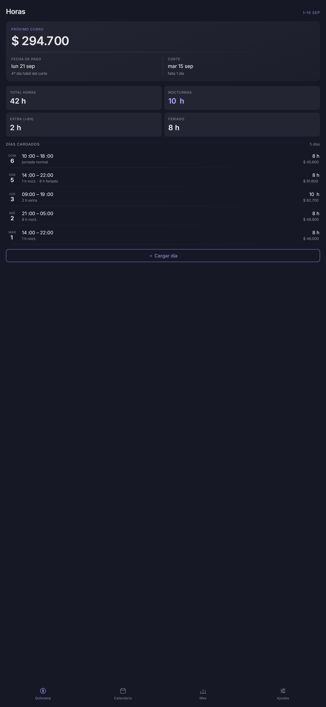
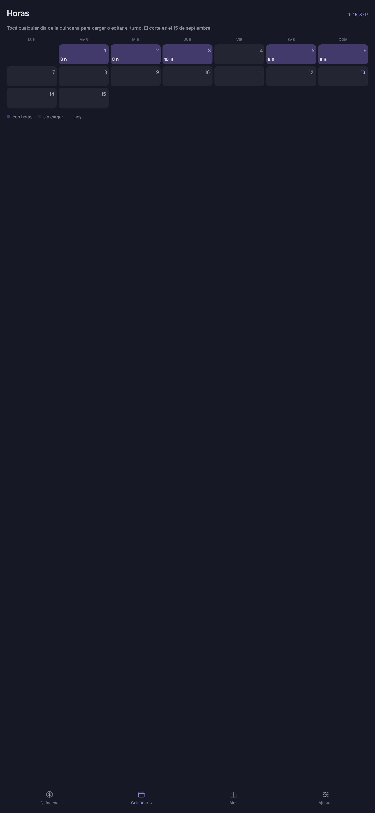
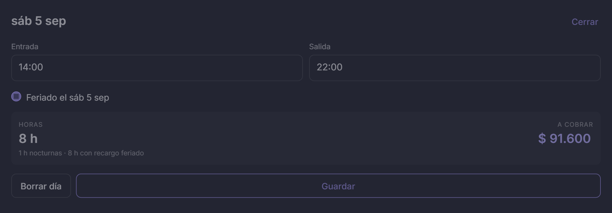

# Horas

App de Android para llevar el control de horas trabajadas por quincena, con recargo
nocturno, hora extra y **feriado** — pensada para trabajo en relación de dependencia
con turnos rotativos (gastronomía, comercio, guardias, etc.).

Nace de un diseño hecho en [Claude Design](https://claude.ai/design) (sistema
"Nocturne") y se empaqueta como app nativa con un WebView, manteniendo exactamente
el mismo diseño visual.

## Capturas

<table>
<tr>
<td width="33%">

**Quincena** — resumen y días cargados



</td>
<td width="33%">

**Calendario** — cualquier día es tocable



</td>
<td width="33%">

**Cargar día** — con el check de Feriado



</td>
</tr>
</table>

Los datos de estas capturas son de ejemplo (no vienen así en una instalación nueva —
la app arranca vacía). Fijate en la primera imagen: el **domingo 6** aparece como
"jornada normal" sin recargo, mientras que el **sábado 5**, que sí se marcó como
feriado, muestra "8 h feriado" y paga más — esa es la regla clave de la app.

## La regla del recargo por feriado

> El recargo por feriado se paga **únicamente** en los días que marcás a mano con el
> check "Feriado" al cargar el turno. **Nunca se aplica solo por caer domingo.**

Ejemplo con los valores por defecto (hora $5.700, plus nocturno $400/h, extra +50%,
feriado +100%):

| Día | Horario | ¿Marcado feriado? | Detalle | Total |
|---|---|---|---|---|
| Martes | 14:00 – 22:00 | No | 1 h nocturna | $ 46.000 |
| Miércoles | 21:00 – 05:00 | No | 8 h nocturnas | $ 48.800 |
| Jueves | 09:00 – 19:00 | No | 2 h extra | $ 62.700 |
| **Sábado** | 14:00 – 22:00 | **Sí** | 1 h noct. · 8 h feriado | **$ 91.600** |
| **Domingo** | 10:00 – 18:00 | No | jornada normal | **$ 45.600** |

El domingo de la tabla cobra exactamente lo mismo que un martes cualquiera: 8 horas
a valor normal. Si ese domingo fuera un feriado nacional, alcanza con tildar el
check correspondiente al cargarlo.

Esto vive en una sola función, `calc()`, dentro de
[`app/src/main/assets/www/index.html`](app/src/main/assets/www/index.html):

```js
// el recargo de feriado sólo aplica si el día fue marcado explícitamente
// como feriado (no por ser domingo)
const special0 = !!e.holiday;
const special1 = !!e.holidayNext; // por si el turno cruza la medianoche
```

## Qué calcula

- **Horas nocturnas**: cualquier hora trabajada entre las 21:00 y las 05:00, se pague
  o no un feriado ese día.
- **Horas extra**: lo que exceda las 8 h en un mismo turno, con el % configurable.
- **Feriado**: el 100% (configurable) sobre las horas del día marcado como feriado.
  Un turno que cruza la medianoche puede marcarse como feriado de un lado, del otro,
  o de ambos, por separado.
- **Quincenas**: cortes el día 15 y el último día del mes; el cobro cae al 4º día
  hábil siguiente al corte (sábados y domingos no cuentan como hábiles).

Todo es configurable desde la pestaña **Ajustes**: valor de la hora, plus nocturno,
% de hora extra y % de feriado.

## Stack

- **UI**: HTML/CSS/JS plano, sin frameworks — un único archivo
  ([`index.html`](app/src/main/assets/www/index.html)) con los tokens de diseño del
  sistema Nocturne (colores, tipografía Inter, componentes).
- **App nativa**: Kotlin, una sola `Activity` con un `WebView` que carga ese HTML
  como asset local a través de
  [`WebViewAssetLoader`](https://developer.android.com/develop/ui/views/layout/webapps/webview#file-access)
  (`https://appassets.androidplatform.net/...` en vez de `file://`, como recomienda
  Google).
- **Persistencia**: `localStorage` del propio WebView — los días cargados y los
  ajustes quedan guardados en el dispositivo, sin backend ni cuenta de usuario.
- **Ícono**: vector adaptativo propio (`app/src/main/res/drawable/ic_launcher_*.xml`)
  + PNG 512×512 para la ficha de Play Store (`store-assets/`).

## Compilar y correr

Requiere [Android Studio](https://developer.android.com/studio) (incluye el SDK y
Gradle).

```bash
git clone https://github.com/HectorAG05/horas-app.git
```

1. Abrí la carpeta del proyecto con **Open** en Android Studio.
2. Dejalo sincronizar (primera vez puede tardar, descarga Gradle 8.7).
3. Conectá un emulador o tu celular (con depuración USB activada) y tocá **Run** ▶.

> ⚠️ Evitá abrir el proyecto desde una carpeta sincronizada por OneDrive/Dropbox —
> Gradle borra y regenera archivos en `build/` todo el tiempo, y esos servicios los
> bloquean, lo que rompe la compilación con errores tipo `Unable to delete directory`.

### Antes de publicar

El `applicationId` en [`app/build.gradle.kts`](app/build.gradle.kts) es el
identificador único de la app (estilo `com.tunombre.horas`) y **no se puede cambiar
después de publicada** — definilo antes de subir la primera versión a Play Store.

## Estructura

```
android-app/
├── app/
│   ├── build.gradle.kts
│   └── src/main/
│       ├── assets/www/index.html   ← toda la UI y la lógica de la app
│       ├── java/.../MainActivity.kt ← WebView + carga de assets locales
│       ├── res/                     ← ícono adaptativo, tema, strings
│       └── AndroidManifest.xml
├── docs/screenshots/                ← las capturas de este README
└── store-assets/                    ← ícono 512×512 para Play Console
```
